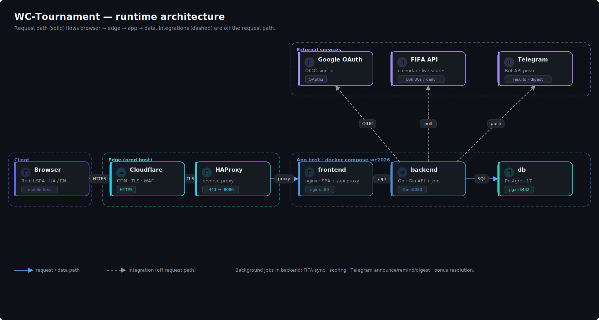
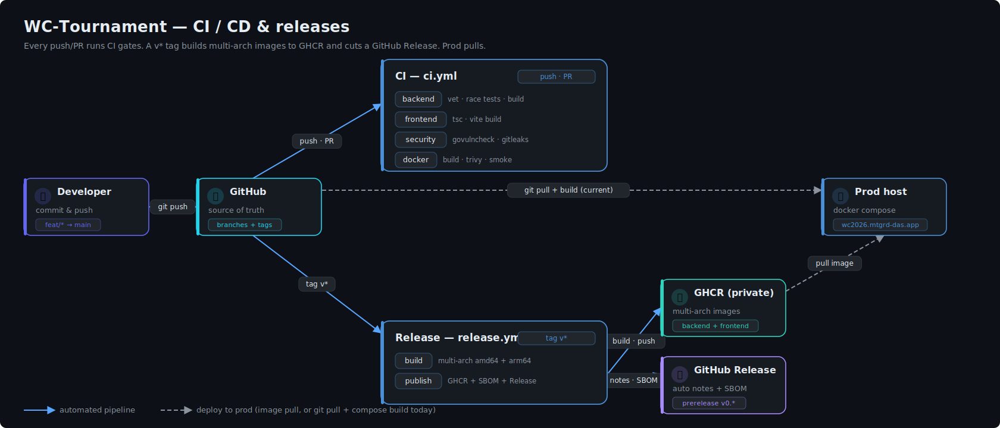

# WC-Tournament 🏆

> A friends-only **FIFA World Cup 2026** score-prediction pool — predict match scores, earn points, climb a live leaderboard. A proof-of-concept for the friends group, built production-grade.

### Live site — offline (archived)

> The **2026 edition has concluded** and the demo server (`wc2026.mtgrd-das.app`) has been retired. The project is fully self-hostable from this repo: restore a backup with [`scripts/restore.sh`](scripts/restore.sh), or bring up a fresh stack with `docker compose up -d --build`. Final results are archived in the pool's spreadsheet alongside the 2018/2022 editions.

[](#live-site--offline-archived)
[](https://github.com/obezsmertnyi/WC-Tournament/actions/workflows/ci.yml)
[](https://github.com/obezsmertnyi/WC-Tournament/actions/workflows/release.yml)
[](LICENSE)

[](backend/)
[](frontend/)
[](frontend/)
[](backend/migrations/)
[](docker-compose.yml)
[](https://github.com/obezsmertnyi/WC-Tournament/pkgs/container/wc-tournament%2Fbackend)

---

> 🗺️ **Lost in the files?** [`docs/REPO-MAP.md`](docs/REPO-MAP.md) indexes every
> file by purpose.

## Contents

- [Overview](#overview) — what it is and who it's for
- [Architecture](#architecture) — runtime topology
- [Features](#features) — what players and admins get
- [Scoring](#scoring) — how points and bonuses work
- [Tech stack](#tech-stack)
- [Getting started](#getting-started) — run it locally
- [CI/CD & releases](#cicd--releases) — pipeline and how to cut a release
- [Deployment](#deployment)
- [Documentation](#documentation) — brief, architecture, ADRs
- [Security](#security)
- [License](#license)

## Overview

A private, invite-only pool: friends predict every World Cup 2026 fixture, the
app scores predictions against official FIFA results, and a live leaderboard +
Telegram bot keep everyone in the loop. Bilingual (UA / EN), mobile-first.
It is **not** a public service — access is gated (see [demo mode](docs/adr/0012-demo-mode-access-tiers.md)).

## Architecture

<a href="docs/diagrams/architecture.svg"></a>

<sub>↑ click to open full-size. The request path is solid; integrations (FIFA, Telegram, Google) are off the request path.</sub>

The backend is a single Go binary: it serves the API **and** runs the
background jobs (FIFA sync, scoring, Telegram announce/remind/digest, bonus
resolution). The frontend is an nginx container serving the SPA and proxying
`/api` to the backend. State lives in Postgres 17.

## Features

- **Predictions** — score every fixture; knockout ties also pick who advances. Locked at kickoff.
- **Live scoring & leaderboard** — points materialize as results arrive from FIFA; bonus column split out.
- **Tournament bonuses** — champion / finalist / top-scorer picks, time-tiered.
- **Knockout bracket** — full tree, geometry-correct ordering, third-place ranking.
- **Telegram bot** — result announcements (congratulates exact-score guessers), pre-match reminders, a 10:00 Kyiv morning digest.
- **Demo mode** — per-user access tiers (`none` / `ro` / `rw`) so a public Google sign-in can't self-enroll into the private pool.
- **Audit log** — public, actions-only feed of who did what.
- **Admin** — predict on behalf of a player, override results, manage the roster and access.

## Scoring

Exact score **3** · correct outcome **1** · wrong **0**. Knockout adds **+1**
for the correct advancer **only when you predicted a regulation draw** (a
decisive score already implies the winner). Penalties count for the advancer
pick only. Tournament bonuses (champion / finalist / top scorer) are
time-tiered and awarded only if correct. No fractions.
See [ADR-0008](docs/adr/0008-scoring-deterministic-utc.md).

## Tech stack

| Layer | Choice |
|------|--------|
| **Backend** | Go 1.26 · Gin · `pgx/v5` · embedded SQL migrations |
| **Frontend** | React 19 · Vite · TypeScript · Tailwind · framer-motion · react-i18next |
| **Database** | Postgres 17 |
| **Auth** | Google OAuth (OIDC) + admin password · JWT cookie |
| **Data** | official FIFA API (ESPN / football-data.org fallbacks) |
| **Notifications** | Telegram Bot API |
| **Packaging** | multi-stage Docker → distroless backend · nginx frontend |
| **Delivery** | docker-compose · GHCR multi-arch images · GitHub Releases |

## Getting started

```bash
cp .env.example .env          # fill in real values; .env is gitignored — never commit secrets
docker compose up -d --build  # db + backend + frontend
# app: http://localhost:8080   ·   backend (debug): http://localhost:8081
```

Local development without Docker:

```bash
make build      # build backend + frontend
make test       # backend tests (set DATABASE_URL for integration tests)
make ci         # run the local equivalent of CI gates
make help       # list all targets
```

## CI/CD & releases

<a href="docs/diagrams/cicd.svg"></a>

<sub>↑ click to open full-size.</sub>

- **CI** ([`ci.yml`](.github/workflows/ci.yml)) on every push/PR: backend
  (`go vet` · race tests against a Postgres service · build), frontend
  (`tsc` + `vite build`), security (`govulncheck` · `gitleaks`), and docker
  (build both images · Trivy scan · smoke test).
- **Release** ([`release.yml`](.github/workflows/release.yml)) on a `v*` tag:
  builds **multi-arch** (`amd64` + `arm64`) images, pushes them to **GHCR**
  (private), attaches an **SBOM** per image, and cuts a **GitHub Release** with
  auto-generated notes (`v0.*` → pre-release).
- **Dependabot** keeps Go, npm, GitHub Actions, and Docker base images current.
- **pre-commit** ([`.pre-commit-config.yaml`](.pre-commit-config.yaml)) mirrors
  the CI gates locally (gofmt, gitleaks, hadolint, actionlint).

Cut a release:

```bash
make release VERSION=v0.1.0   # tags + pushes; the workflow builds images and the Release
```

The build version is stamped into the binary (`-ldflags -X main.version`,
surfaced at `/api/healthz`) and into the frontend bundle (`VITE_APP_VERSION`,
shown in the footer).

## Deployment

Production runs the same `docker-compose.yml` behind HAProxy + Cloudflare. The
multi-arch GHCR images mean prod can pull a tagged release instead of building
locally (which also avoids the `amd64`/`arm64` mismatch). See
[ADR-0004](docs/adr/0004-local-docker-compose-deployment.md).

The **AI assistant** is opt-in: prod adds the `docker-compose.gemini.yml` overlay
(`docker compose -f docker-compose.yml -f docker-compose.gemini.yml up -d`), which
mounts the keyless WIF credentials and sets `AI_ENABLED=true` (ADR-0017). Without
it the assistant stays off (503) and the app is unaffected. Full backup/rollback
runbook: [`VERIFY.md`](VERIFY.md).

## Documentation

Design and decisions live in [`docs/`](docs/):

- [Project brief](docs/project-brief.md) — scope and goals
- [Architecture](docs/architecture.md) — the full design
- [ADRs](docs/adr/README.md) — every significant decision, numbered and dated
- [Diagrams](docs/diagrams/) — source SVGs

## Security

See [SECURITY.md](SECURITY.md) for the posture and how to report a
vulnerability. Secrets live only in `.env` / the host environment and are never
committed; CI scans the history with gitleaks and images with Trivy.

## License

[MIT](LICENSE) © 2026 Olexander Bezsmertnyi
